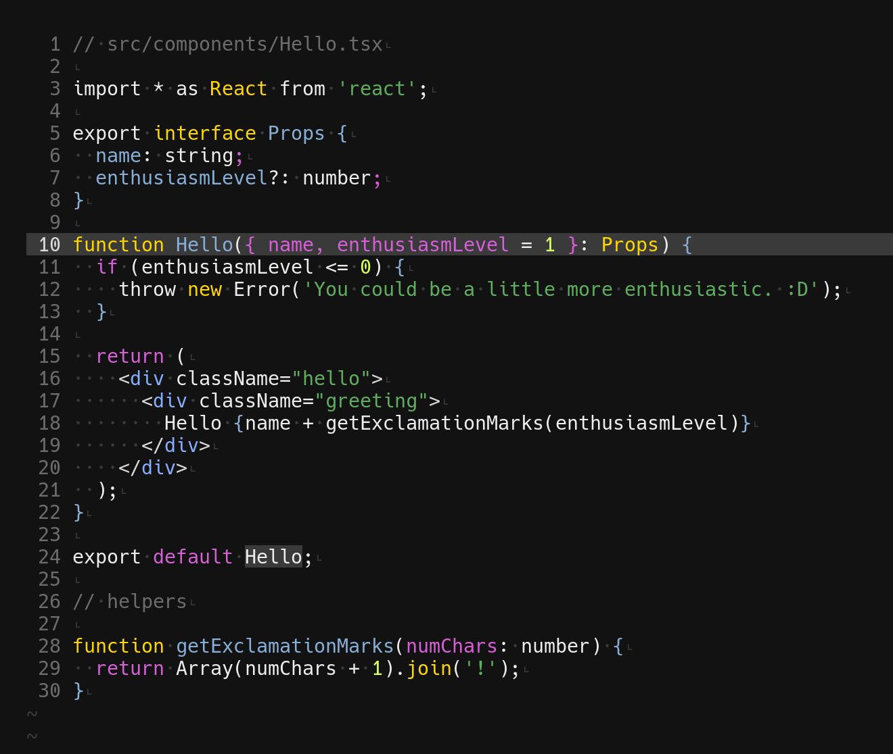

<div align="center">
  <h3>
    SpaceCamp is an attractive, comfortable, and legible colorscheme for Vim. This is the port for Kitty terminal.
  </h3>
</div>


<div align="center">
  <h2>
    Flight Instructions
  </h2>
</div>

1. Clone this repo
2. Copy the `spacecamp.conf` file to a preferred location
3. Add an include to your `kitty.conf` file, like this:

```
include ./path/to/theme/spacecamp.conf
```

### Screenshot



### Colors

```
background #121212
foreground #d0d0d0
selection_background #d0d0d0
selection_foreground #121212
url_color #91aadf
cursor #d0d0d0
active_border_color #666666
inactive_border_color #d8fa3b
active_tab_background #282828
active_tab_foreground #dedede
inactive_tab_background #dedede
inactive_tab_foreground #282828

# normal
color0 #282828
color1 #d71a1a
color2 #57ba37
color3 #f0d50c
color4 #91aadf
color5 #cf73e6
color6 #b7cbf4
color7 #dedede

# bright
color8 #666666
color9 #ff0000
color10 #d8fa3b
color11 #e7c547
color12 #b7cbf4
color13 #b77ee0
color14 #a9c1de
color15 #eeeeee
```

### Credits

Credit on colors and readme.md file layout to [Jared Gorski's SpaceCamp vim colors](https://github.com/jaredgorski/SpaceCamp).
